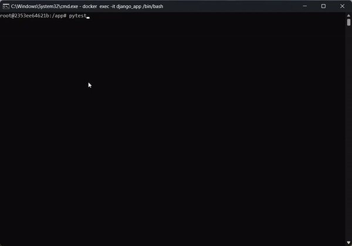

# Ecommerce-Django-REST-APIs (RadinGalleryAPI)

## Overview
RadinGalleryAPI is a project built with Django REST Framework designed to provide a complete set of APIs for an e-commerce site. This includes features like user authentication, product management, and more. The goal is to develop, test, and document these APIs thoroughly, ensuring seamless integration and a high-quality experience.

## API Documentation
You can view the latest API documentation, including the current status of all endpoints, through the Swagger interface at the following link:  
[Swagger Documentation](https://mhdemd.github.io/Ecommerce-Django-REST-APIs/)

## Features
- Full API implementation for an e-commerce site using Django REST Framework.
- User authentication and authorization.
- Integration with Swagger for easy documentation and seamless API interaction.
- Dockerized application setup with Django and PostgreSQL for the database.
- Use of Redis for:
  - Caching data, including storing user click counts for throttling purposes.
  - Storing Django's default session data.
  - Managing task queues as a message broker for Celery.
  - **Storing temporary tokens** for email verification and OTPs for enhanced security and performance.

## Testing
This project includes a suite of tests to ensure the correct functionality and performance of the API endpoints.

 

## Security Measures
For detailed information on the security measures implemented in this project, please refer to the [Security Measures](docs/md-file/Security.md) document.

## License
This project is licensed under the [MIT License](./LICENSE.md). By using this software, you agree to the terms and conditions outlined in the License.

## Contributing
We welcome contributions! Please read our [Contributing Guidelines](./CONTRIBUTING.md) for detailed instructions.

Feel free to reach out or open an issue for discussions and suggestions.

## Contact
If you have any questions, please contact me at [mahdi.emadi@yahoo.com](mailto:mahdi.emadi@yahoo.com).
